<!-- Generated by GitHub Profile Agent Console. Edit profile.config.json, then run npm run generate. -->

  <picture>
    <source media="(max-width: 760px) and (prefers-color-scheme: dark)" srcset="./assets/hero/agent-console-d383f89a-mobile-dark.svg">
    <source media="(max-width: 760px)" srcset="./assets/hero/agent-console-d383f89a-mobile-light.svg">
    <source media="(prefers-color-scheme: dark)" srcset="./assets/hero/agent-console-d383f89a-dark.svg">
    <source media="(prefers-color-scheme: light)" srcset="./assets/hero/agent-console-d383f89a-light.svg">
    
  </picture>

  

## About Me

I study Electrical Engineering at Telkom University, focusing on industrial automation turning sensors, signals, and control systems into things that actually work in the field.

My work combines technical exploration with a builder mindset understand the problem, test the system, and share what actually works.

## Current Focus

| Area | What I am exploring |
| --- | --- |
| **IoT** | Building connected systems from sensors to dashboards, hardware to cloud. |
| **Telecommunication** | Understanding how data travels wireless links and protocols that keep devices talking. |
| **Electrical** | Designing and simulating circuits as the backbone of every build. |

## Featured Work

| Project | Focus | Why it matters |
| --- | --- | --- |
| [**SIMS**](https://github.com/Seedkeey/SIMS) | Monitoring System | IoT based infusion monitoring for medical environments real time status tracking to help medical staff respond faster. |

## Research Direction

Exploring how IoT and telecommunication can make industrial systems smarter sense, transmit, decide, automate.

## Tech Stack

`Autocad` · `Proteus` · `Python` · `Arduino / ESP32` · `C/C++`

## Recent Activity

<!-- AUTO:ACTIVITY:START -->
- Aug 1, 2026: pushed 1 commit to [Seedkeey/Seedkeey](https://github.com/Seedkeey/Seedkeey).
- Aug 1, 2026: created a branch in [Seedkeey/Seedkeey](https://github.com/Seedkeey/Seedkeey).
<!-- AUTO:ACTIVITY:END -->

---

  i build what i like

