<!-- Generated by GitHub Profile Agent Console. Edit profile.config.json, then run npm run generate. -->

  <picture>
    <source media="(max-width: 760px) and (prefers-color-scheme: dark)" srcset="./assets/hero/agent-console-e7f775b0-mobile-dark.svg">
    <source media="(max-width: 760px)" srcset="./assets/hero/agent-console-e7f775b0-mobile-light.svg">
    <source media="(prefers-color-scheme: dark)" srcset="./assets/hero/agent-console-e7f775b0-dark.svg">
    <source media="(prefers-color-scheme: light)" srcset="./assets/hero/agent-console-e7f775b0-light.svg">
    
  </picture>

  

## About Me

-

My work combines technical exploration with a builder mindset: understand the problem, test the system, and share what actually works.

## Current Focus

| Area | What I am exploring |
| --- | --- |
| **IoT** | I like build |
| **Telecommunication** | nn |
| **Electrical** | nn |

## Featured Work

| Project | Focus | Why it matters |
| --- | --- | --- |
| [**SIMS**](https://github.com/Seedkeey/SIMS) | Monitoring System | ss |

## Research Direction

-

## Tech Stack

`Autocad` · `Proteus` · `Python`

## Recent Activity

<!-- AUTO:ACTIVITY:START -->
_Recent public activity will appear here after the workflow runs._
<!-- AUTO:ACTIVITY:END -->

---

  i build what i like

